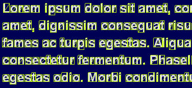
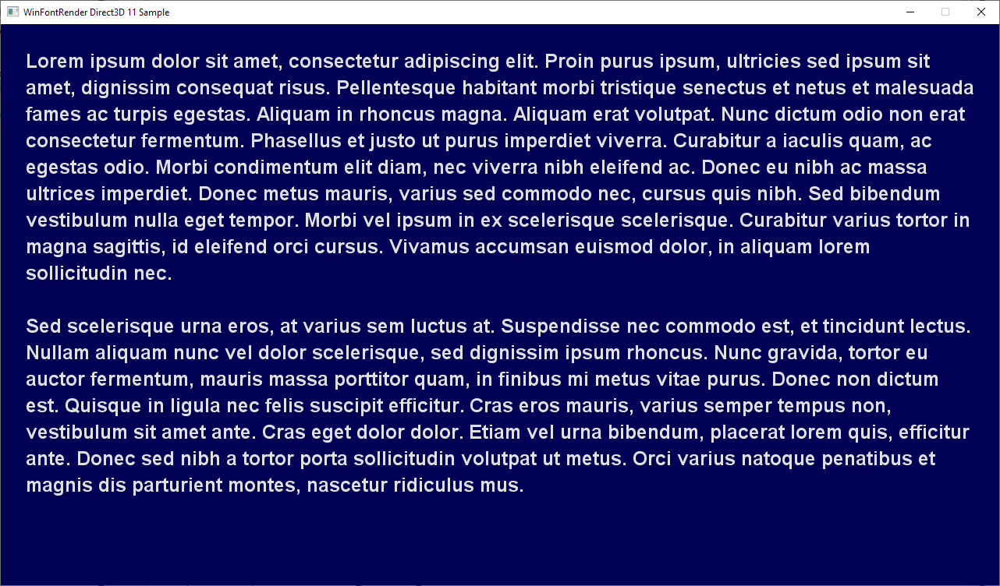
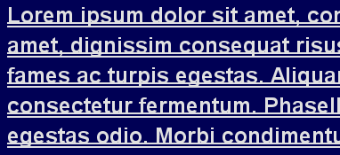

# WinFontRender

This is a small single-header C++ library that renders Windows fonts in graphics applications.

## Problem

While developing various kinds of programs, we often take the possibility of displaying text for granted, as we get this functionality out-of-the-box. This is the case in console apps, where we can just print characters and they are displayed in the terminal. This is also the case in GUI apps (whether made in Windows Forms, WPF, Qt, wxWidgets, MFC) - we have labels, buttons, and other controls available.

However, this is not the case when we develop a graphics program or a game using one of the graphics API like Direct3D, OpenGL, or Vulkan. Then the only thing we can do is rendering triangles covered with textures. That's how graphics cards work after all. Displaying text is challenging in this environment, as every single character has to be turned into a textured quad made of two triangles.

## Solution

This library provides solution to this problem by implementing a `CFont` class, which does two things:

1. It renders characters of the font to a texture, tightly packed.

   

2. It calculates vertices needed to render given text.

   

## Prerequisites

- The library is written in object-oriented C++. No advanced template trickery is used, but some C++11 features may appear.
- It has form of a single file "WinFontRender.h", which you can just copy to your project. Everything else is example usage code and documentation.
- It is based on slightly modified MIT license, so it's free to use in any projects, including closed-source, proprietary, and commercial. See [LICENSE](LICENSE) for details.
- It depends only on standard C and C++ library (including some basic STL - `std::vector`, `std::wstring`) and WinAPI (Windows.h).
- It is agnostic to graphics API. It only provides CPU buffer with data that you need to upload to the GPU as a texture, and fills your CPU buffer with data that you need to render as vertex and index buffer. It is your responsibility to do actual rendering using API of your choice, whether it's Direct3D 9, 11, 12, OpenGL, or Vulkan.
- It uses a font installed in the system, based on given name and other parameters (e.g. "Arial", size = 32, bold). It cannot load fonts from existing textures or standalone font files. If you need the latter, [FreeType](https://www.freetype.org/) is a popular library for this.
- It is intended for usage on Windows only. Linux, MacOS, Android, or any other platforms are not supported.
- It is developed and tested in Microsoft Visual Studio 2017 in 64-bit configuration. Theoretically it should work in 32-bit configuration or with other compilers.
- It uses Unicode strings, like `const wchar_t*` or `std::wstring`. If you prefer ANSI or UTF-8, you need to convert them first, e.g. using WinAPI function `MultiByteToWideChar`.
- Example project is included that demonstrates usage of the library in a simple Direct3D 11 application:

  

## Quick start

### 1. Including the library

"Single header" doesn't mean everything is contained in function declarations, like it tends to be in case of inline functions or C++ templates. It means that implementation is bundled with interface in a single file and needs to be extracted using a preprocessor macro. If you don't do it properly, you will get linker errors.

To do it properly:

1. Include "WinFontRender.h" file in each CPP file where you want to use the library. This includes declarations of all public members of the library.
2. In exacly one CPP file define following macro before this include. It enables internal implementation (function definitions).

```cpp
#define WIN_FONT_RENDER_IMPLEMENTATION
#include "WinFontRender.h"
```

It may be a good idea to create dedicated CPP file just for this purpose.

The library defines two sets of helpers types. First one includes `wstr_view` type, which represents a view into an existing Unicode string. It is actually a copy of my another library called [str_view](https://github.com/sawickiap/str_view) - "Null-termination-aware string-view class for C++". I encourage you to take a look at it. You may find it useful. If you don't care, please just remember that parameters of type `wstr_view` support implicit conversion from null-terminated strings `const wchar_t*`, as well as `std::wstring`.

All symbols other than the string view mentioned above are defined in namespace `WinFontRender`.

Second set of helper types are very simple vector structures: `bvec2`, `bvec4` (for `bool`), `ivec2`, `ivec4` (for `int32_t`), `uvec2`, `uvec4` (for `uint32_t`) and `vec2`, `vec4` (for `float`). Basic thing to remember about them is that you can construct them by either specifying separate components, like `vec2(1.0f, 2.0f)`, or by passing pointer to the array of components.

### 2. Creating font object

```cpp
CFont* font = new CFont();

SFontDesc fontDesc;
fontDesc.FaceName = L"Arial";
fontDesc.Height = 30;
fontDesc.Flags = SFontDesc::FLAG_BOLD;
font->Init(fontDesc);
```

- `FaceName` must be name of font installed in the system.
- `Height` is font size, in pixels.
- `Flags` can include flags from `SFontDesc::FLAGS` enum, e.g. `SFontDesc::FLAG_BOLD`, `SFontDesc::FLAG_ITALIC`.

Don't forget to `delete font` at the end.

### 3. Creating texture

Texture data is stored inside `CFont` object. You can query for it and use it to create a texture in your graphics API. You can then tell the font to free the data.

```cpp
uvec2 size;
size_t rowPitch;
const void* data;
font->GetTextureData(data, size, rowPitch);

CD3D11_TEXTURE2D_DESC textureDesc = CD3D11_TEXTURE2D_DESC(
    DXGI_FORMAT_A8_UNORM, size.x, size.y, 1, 1, D3D11_BIND_SHADER_RESOURCE, D3D11_USAGE_IMMUTABLE);
D3D11_SUBRESOURCE_DATA initialData = {data, (UINT)rowPitch, 0};
ID3D11Texture* texture;
d3d11Device->CreateTexture2D(&textureDesc, &initialData, &texture);

font->FreeTextureData();
```

### 4. Filling vertex buffer and rendering

You can use your own vertex structure. You need to allocate vertex and optional index buffer and pass their parameters to the font, so they can be filled with data for given text.

```cpp
struct SVertex
{
    vec2 Pos;
    vec2 TexCoord;
};

// Index buffer not used in this example. See sample project for example of index buffer usage.
constexpr vbFlags = VERTEX_BUFFER_FLAG_TRIANGLE_LIST;

// (...)
const wchar_t* text = /* ... */
const float fontSize = 32.0f;
const uint32_t flags = CFont::FLAG_WRAP_WORD | CFont::FLAG_HLEFT | CFont::FLAG_VTOP;
const vec2 leftTopPosition = vec2(8.f, 8.f);
const float textWidth = 512.0f;

const size_t quadCount = m_Font->CalcQuadCount(text, fontSize, flags, textWidth);
size_t vertexCount, indexCount;
QuadCountToVertexCount<vbFlags>(vertexCount, indexCount, quadCount);

std::vector<SVertex> vertices(vertexCount);

SVertexBufferDesc vbDesc;
vbDesc.FirstPosition = &vertices[0].Pos;
vbDesc.FirstTexCoord = &vertices[0].TexCoord;
vbDesc.PositionStrideBytes = sizeof(SVertex);
vbDesc.TexCoordStrideBytes = sizeof(SVertex);
vbDesc.FirstIndex = nullptr;
font->GetTextVertices<vbFlags>(vbDesc, leftTopPosition, text, fontSize, flags, textWidth);

// (...)
// Upload vertices to the GPU and set as vertex buffer. Finally:
d3d11Context->IASetPrimitiveTopology(D3D11_PRIMITIVE_TOPOLOGY_TRIANGLELIST);
d3d11Context->Draw((UINT)vertexCount, 0);
```

## Additional consideration

**Multiline text** is supported with explicit line breaks on `'\n'`, `"\r\n"`, as well as automatic wrap on whole word boundaries (with `CFont::FLAG_WRAP_WORD` used) or single character boundaries (with `CFont::FLAG_WRAP_CHAR` used) when text width is limited.

**Horizontal and vertical alignment** is supported to left/center/right and top/middle/bottom. Use flags `CFont::FLAG_HLEFT`, `CFont::FLAG_HCENTER`, `CFont::FLAG_HRIGHT`, `CFont::FLAG_VTOP`, `CFont::FLAG_VMIDDLE`, `CFont::FLAG_VBOTTOM`.

**Vertex format** is flexible. Positions and texture coordinates must be pairs of floats. You can fill structure `SVertexBufferDesc` with parameters describing your positions and texture coordinates laid out in the same or separate streams and with any vertex strides.

Various **vertex topologies** are supported. By using `VERTEX_BUFFER_FLAG_*` flags, you can request vertices generated as triangle list, triangle strip with primitive restart index, or triangle strip with degenerate triangles. You can also use 16-bit indices, 32-bit indices, or no index buffer. These flags need to be known at compile time because they are template parameter, for performance reason.

**Vertex positions** are assumed to be expressed in pixels, from left-top as (0, 0). All triangles have clockwise winding.

**Texture coordinates** are configurable. By default a coordinate system is assumed that samples textures from left-top as (0, 0), like in DirectX or Vulkan. You can use `SFontDesc::FLAG_TEXTURE_FROM_LEFT_BOTTOM` to change it to a coordinate system where textures are sampled from left-bottom as (0, 0), like in OpenGL.

**Texture format** is always single component, 8 bits per pixel. It can be interpreted as `DXGI_FORMAT_R8_UNORM` or `DXGI_FORMAT_A8_UNORM`.

Among various **advanced font features**, the library supports **kerning**, which is handled automatically. It doesn't support ligatures, colourful emoji, right-to-left or other complex writing systems like Hindi, Arabic, Hebrew etc.

Fonts use **antialiasing**, which means edges are smoothed with many shaders of gray, not just 0 or 1. Sub-pixels antialiasing (on the level of separate RGB monitor subpixels) is not supported.

Fonts are **pixel-perfect**, which means they are not scaled and filtered, as long as you use the same value as `fontSize` parameter while rendering and `SFontDesc::Height` while creating the font. It makes even small fonts looking quite good and clear.


**Underlines** can be added using `CFont::FLAG_*` flags in many flavors - as `CFont::FLAG_UNDERLINE`, `CFont::FLAG_OVERLINE`, `CFont::FLAG_STRIKEOUT`, and even `CFont::FLAG_DOUBLE_UNDERLINE`:



Not all 65536 **Unicode characters** are rendered to texture. By default these are only characters in range 32..127. It means traditional ANSI - it covers Latin letters and the symbols that are on your keyboard. You can choose which ones are rendered to support diacritic letters of your language or some other symbols that you need. To do it, you need to specify custom character ranges (pairs of characters) when initializing a font:

```cpp
const wchar_t charRanges[] = {
    // Default range
    32, 127,
    // Polish diacritics
    0x0104, 0x0105,
    0x0106, 0x0107,
    0x0118, 0x0119,
    0x0141, 0x0142,
    0x0143, 0x0144,
    0x00D3, 0x00D3,
    0x00F3, 0x00F3,
    0x015A, 0x015B,
    0x0179, 0x017C,
    // German diacritics
    0x00C4, 0x00C4,
    0x00D6, 0x00D6,
    0x00DC, 0x00DC,
    0x00DF, 0x00DF,
    0x00E4, 0x00E4,
    0x00F6, 0x00F6,
    0x00FC, 0x00FC,
};

SFontDesc fontDesc;
fontDesc.FaceName = L"Arial";
fontDesc.Height = 30;
fontDesc.Flags = SFontDesc::FLAG_BOLD;
fontDesc.CharRangeCount = _countof(charRanges) / 2;
fontDesc.CharRanges = charRanges;
font->Init(fontDesc);
```


**Hit testing** is available. Methods `CFont::HitTestSingleLine` and `CFont::HitTest` provide a test of point (e.g. mouse cursor position) against text. They return index of the character that is hit at this point.

**Error handling** is very simple. It doesn't use C++ exceptions. The only function that can fail is `CFont::Init`. It just returns `bool`.

**Performance** of vertex generation should be quite good, suitable for calling every frame. `CFont::FLAG_WRAP_SINGLE_LINE` is the fastest mode, and so are the functions with "SingleLine" in their names. `CFont::FLAG_VMIDDLE` and `CFont::FLAG_VBOTTOM` are slow.

**Thread safety** is ensured as there is no unexpected global state. Different objects of `CFont` class can be created by different threads and used simultaneously. Calling `const` methods of a single `CFont` object from different threads simultaneously is also safe.
